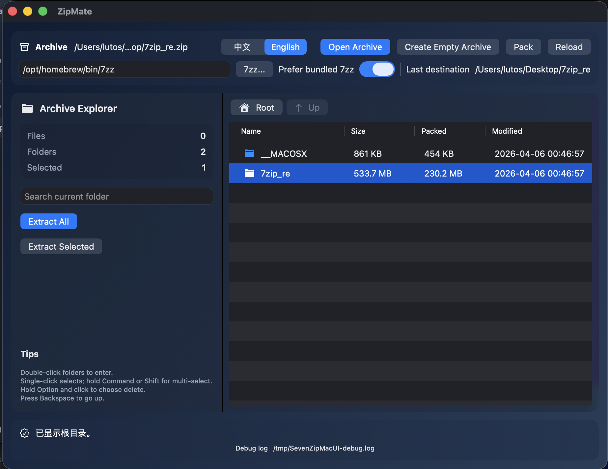

# ZipMate

Minimal 7-Zip UI for macOS.

ZipMate is a lightweight 7-Zip frontend on Mac.
It keeps the 7-Zip engine, wraps it in a native SwiftUI shell, and focuses on one goal: fast archive work with low friction.



## Why

- 7-Zip workflow, macOS-native UI
- Minimal surface, practical defaults
- A clean replacement for Finder's limited archive flow

## Features

- Open `zip` / `7z` / `rar` / `tar`
- Browse archives like a file manager
- Double-click row to enter folders
- Single-click to select, multi-select with Command/Shift
- Extract all / extract selected
- Extract by drag-out (to Desktop/Finder folders)
- Drag-in files/folders to add into current archive path
- Create empty archives
- Create archives from selected files/folders
- Chinese / English UI switch
- Bundled `7zz` support (works without preinstalled 7-Zip)

## Install

1. Download `ZipMate.dmg` from Releases.
2. Open DMG, drag `ZipMate.app` to `Applications`.
3. First launch can configure archive file associations.

## Build

```bash
swift build -c release
```

## Run

```bash
swift run
```

## Engine

Bundled engine path:

```text
Sources/SevenZipMacUI/Resources/7zz
```

If enabled in UI, ZipMate will prioritize this built-in binary.

## Star History

[](https://star-history.com/#VisualFLT/ZipMate&Date)

## License Notes

ZipMate is a UI/workflow layer around 7-Zip.
Please review upstream 7-Zip license terms and unRAR restrictions before redistribution.

---

## 中文说明

ZipMate 是一个面向 macOS 的极简 7-Zip 图形界面。
核心目标是把 7-Zip 的能力用 Mac 原生方式交付出来：少配置、低心智负担、直接可用。

### 设计方向

- 基于 7-Zip 引擎
- 原生 SwiftUI 界面
- 极简但高频功能完整
- 可作为 macOS 上 7-Zip 使用体验的平替

### 主要功能

- 打开并浏览 `zip` / `7z` / `rar` / `tar`
- 类资源管理器浏览压缩包内容
- 双击行进入目录，单击选择
- 解压全部、解压选中
- 直接拖出文件到桌面/Finder 目录解压
- 拖入文件/目录到当前压缩包路径进行打包
- 创建空压缩包
- 选择文件后打包为新压缩包
- 中英界面切换
- 支持内置 `7zz`（无需系统预装 7-Zip）

### 安装

1. 从 Releases 下载 `ZipMate.dmg`
2. 打开后拖动 `ZipMate.app` 到 `Applications`
3. 首次启动可按需勾选压缩包后缀关联

### 许可说明

本项目提供的是 7-Zip 在 macOS 上的 UI 与工作流封装。
发布与分发时请同步遵循 7-Zip 上游许可与 unRAR 相关限制条款。
